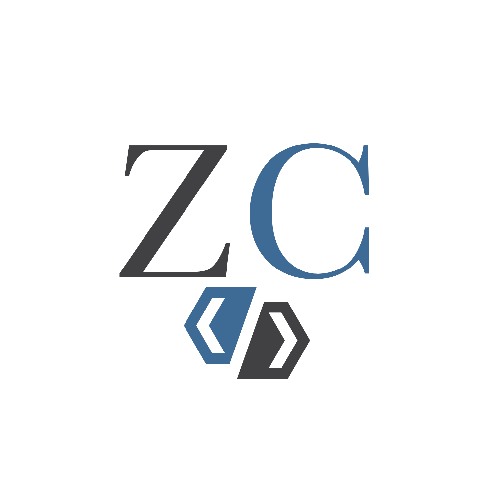

  
   

  <h3><b>Capstone Project: LevelUp Sumit</b></h3>

<!-- TABLE OF CONTENTS -->

# 📗 Table of Contents

- [📖 About the Project](#about-project)
  - [🛠 Built With](#built-with)
    - [Tech Stack](#tech-stack)
    - [Key Features](#key-features)
  - [🚀 Live Demo](#live-demo)
- [💻 Getting Started](#getting-started)
  - [Setup](#setup)
  - [Prerequisites](#prerequisites)
  - [Install](#install)
  - [Usage](#usage)
  - [Run tests](#run-tests)
  - [Deployment](#triangular_flag_on_post-deployment)
- [👥 Authors](#authors)
- [🔭 Future Features](#future-features)
- [🤝 Contributing](#contributing)
- [⭐️ Show your support](#support)
- [🙏 Acknowledgements](#acknowledgements)
- [📝 License](#license)

<!-- PROJECT DESCRIPTION -->

# 📖 Capstone Project: LevelUp Sumit 

The LevelUp Summit website boasts a modern and intuitive design that's optimized for mobile devices. Its responsive layout ensures a seamless user experience across all screen sizes and resolutions. The mobile menu design is sleek and easy to use, making it simple for users to navigate the website and find the information they need.

In addition to its impressive design, the LevelUp Summit website features an array of cutting-edge functionalities. Its dynamic pages are optimized for fast loading speeds and smooth transitions. This Capstone Project is a testament of my skills in SASS, CSS, HTML, and JavaScript.

[🎥 Check out this video of me explaining the key features of the project](https://www.loom.com/share/1a2b5e7e1ce744acb831c75d3ede5c46)

## 🛠 Built With 

### Tech Stack 

- HTML
- CSS
- SASS
- JavaScript

<!-- Features -->

### Key Features 

- **Mobile Responsive**
- **Modern Design**
- **Smooth Mobile Menu Animations**

(<a href="#readme-top">back to top</a>)

<!-- LIVE DEMO -->

## 🚀 Live Demo 

- [Live Demo Link](https://zamcham.github.io/Level-Up-Summit/)

(<a href="#readme-top">back to top</a>)

<!-- GETTING STARTED -->

## 💻 Getting Started 

This live demo is really easy to navigate, just click on the live demo link and feel free to shrink or expand your browser window.

### Prerequisites

In order to run this project you need: A browser, tha's all!

(<a href="#readme-top">back to top</a>)

<!-- AUTHORS -->

## 👥 Authors 

👤 **Cristian "ZamCham"**

- GitHub: [@zam-cham](https://github.com/zam-cham)
- Twitter: [@zamchamgames](https://twitter.com/zamchamgames)
- LinkedIn: [LinkedIn](https://linkedin.com/in/cristian-zamcham)

(<a href="#readme-top">back to top</a>)

<!-- FUTURE FEATURES -->

## 🔭 Future Features 

- [ ] **More Animations**
- [ ] **Sign Up Form**
- [ ] **Automatic Popups**

(<a href="#readme-top">back to top</a>)

<!-- CONTRIBUTING -->

## 🤝 Contributing 

Contributions, issues, and feature requests are welcome!

Feel free to check the [issues page](../../issues/).

(<a href="#readme-top">back to top</a>)

<!-- SUPPORT -->

## ⭐️ Show your support 

If you like this project, let me know on any of my social media account ;)

(<a href="#readme-top">back to top</a>)

<!-- ACKNOWLEDGEMENTS -->

## 🙏 Acknowledgments 

I would like to thank the Microverse team

(<a href="#readme-top">back to top</a>)

<!-- LICENSE -->

## 📝 License 

This project is [MIT](./LICENSE.txt) licensed.

(<a href="#readme-top">back to top</a>)

